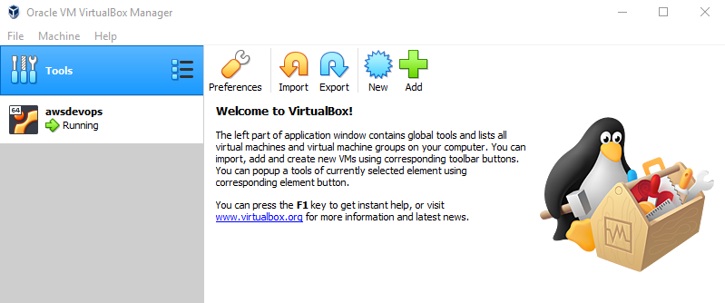

# AWS LABS IAC (Infrastructure as code)
How to create infra in AWS with terraform and provision the created ec2 instance with ansible (by using command line and ssm)

Terraform will create:  
1 vpc  
1 internet gateway  
2 subnet (1 public and 1 private )  
2 routes (1 per subnet)  
1 security group (for ssh, http and https)  
1 nacl  
1 IAM role for ssm  

## PREREQUISITES
You need to have these programs in place:
-  [Vagrant](https://www.vagrantup.com/downloads.html): download the proper package for your operating system and architecture (Click on Windows 64-bit link). 
-  [VirtualBox](https://www.virtualbox.org/wiki/Downloads): by downloading, you agree to the terms and conditions of the respective license. (Click on Windows hosts link)  
- Be sure VT-x is enabled in your Bios.

**Notes:**
- Follow default installation, by clicking on next, next, next, etc.
- After the software was installed, restart your computer. Once your system is back, open a command prompt and be sure that the following command is working: vagrant -v.

## FIRST STEP (creating ubuntu server that will be used to create the infra in aws and also to provision the software)

- Fork the repository
- Clone this repository
- goto folder aws_labs_iac
- run the follwing command: **vagrant up**
  
**FIGURE 3: You can check the progress also by opening Oracle VM Virtual Box Manager**
- once script is done, you can connect to the VM by using the following command: **vagrant ssh awslabsiac**
- once logged in: configure your aws client by running: **aws configure**

## SECOND STEP
- Clone this repository again, but now in linux vm by running: **git clone https://github.com/gberlotperalta/aws_labs_iac.git** 
- Create a key pair in aws console (.pem) and later download on your local git repo.

## CREATING INFRA
- Run the following commands.

sudo bash  
cd /aws_labs_iac    
cp <Your_Pem_File_Name>.pem /home/vagrant  
cd /home/vagrant  
chmod 400 <Your_Pem_File_Name>.pem  

- Test connectivity by ussing ssh type:  
ssh -i "G1B4.pem" ubuntu@<aws_instance_public_DNS>

#ssh -i "G1B4.pem" ubuntu@ec2-54-158-195-233.compute-1.amazonaws.com

#PROVISIONING USING ANSIBLE (from vagrant VM)  
Run the following commands:  
- cd ansible/apache  
- ansible-playbook -i aws_host.yml playbook.yml

#PROVISIONING USING AWS SSM (from Aws System Manager)
Prerequistes to run ansible from SSM 
1) SSM Agent must be installed on the ec2 instance (By default aws ssm agent is installed in ubuntu 18.04 lts. In case you find some issues you can find more details [here](https://docs.aws.amazon.com/systems-manager/latest/userguide/sysman-manual-agent-install.html#agent-install-ubuntu)
2) Ansible should be installed on the ec2 (Ansible was installed when the ec2 instance was created, check userdata.sh)
3) IAM role for SSM must be created (done, when the ec2 instance was created, see )

Next, goto Aws System Manager in your aws console and perform the following steps:  
- Click on State Manager and click on create association.  
- As name type "Install-Apache-from-Ansible".  
- Document, search for "AWS-ApplyAnsiblePlaybooks" and select it.  
- Parameters, source type -> Github.  
- Source Info -> {"owner":"gberlotperalta","repository":"aws_lab_devops","path":"ansible/apache","getOptions":"branch:master"}  
- Install Dependencies -> True  
- Playbokk File -> playbook-ssm.yml
- Leave the rest as it's.  
- Select your aws ecs instance.  
- No schedule. 
- Compliance Severity -> High 
- Click on Create Association.

y hacer que la vpc tengo flowlogrole por defecto

https://medium.com/chrisjerry/architect-using-terraform-dd1ae7da98f4
https://jee-appy.blogspot.com/2018/07/create-aws-infrastructure-with-terraform.html
https://medium.com/@brad.simonin/create-an-aws-vpc-and-subnet-using-terraform-d3bddcbbcb6
